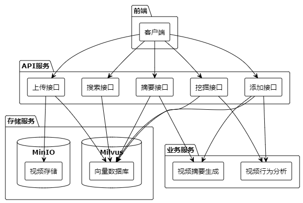
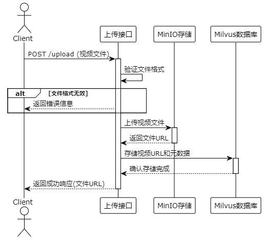
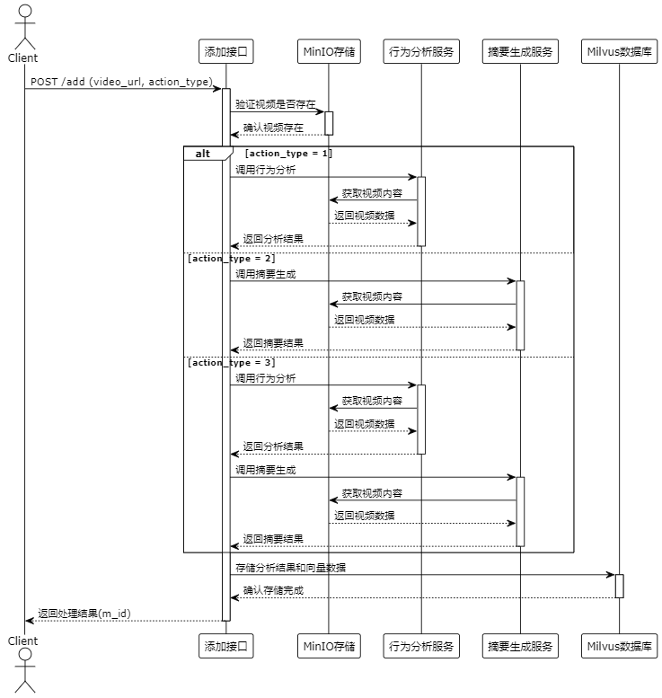
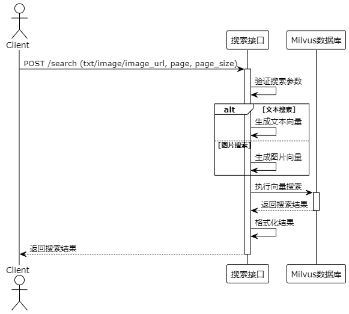

# 视频分析系统数据流图

## 1. 系统组件图
+ 
+ 
系统主要由四个部分组成：
- 前端：用户交互界面
- API服务：处理各类请求的接口层
- 业务服务：视频分析和摘要生成的核心功能
- 存储服务：视频文件和向量数据的存储层

## 2. 视频上传时序图
+ 
+ 
视频上传流程：
- 用户上传视频到系统
- 系统验证并存储视频文件
- 返回可访问的视频URL

## 3. 视频添加时序图
+ 
+ 
视频添加流程：
- 用户选择分析类型（挖掘/摘要/完整分析）
- 系统进行相应的视频分析
- 存储分析结果并返回

## 4. 视频搜索时序图
+ 
+ 
视频搜索流程：
- 用户输入搜索条件
- 系统在向量库中检索匹配结果
- 返回相关视频列表